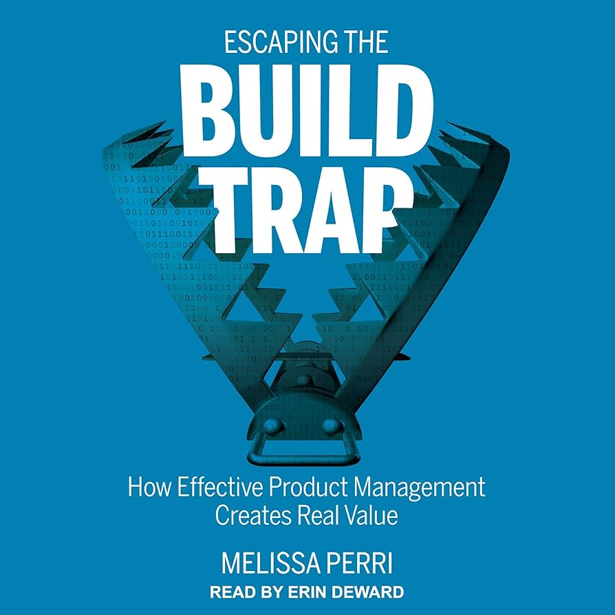

# Product Book Club

## Kickoff Meeting

January 30, 2026

---

# Quick Introductions

Let's go around and share:

- **Your name and role**
- **What you hope to get out of this book club**

Keep it brief - about 30 seconds each

---

# Why I Started This

- Been reading product books to **broaden my mindset and impact**
- Want to be a **better teammate** with PMs, designers, and leads
- Learning to **work better at a larger company** (_so many roles!_)
- Thought: why not **bring others along** on the journey?

> Become more effective by thinking like a PM

---

# Why Product Management Books?

- PMs touch **operations, strategy and execution** - a bit of everything
- Helps us understand the **broader context** of our work
- Better **cross-functional collaboration**
- Useful whether you're an IC, lead, or aspiring PM

---

# Our Reading List

| # | Book | Author |
|---|------|--------|
| 1 | Escaping the Build Trap | Melissa Perri |
| 2 | The Art of Action | Stephen Bungay |
| 3 | Amp It Up | Frank Slootman |
| 4 | Inspired | Marty Cagan |

---

# Why Each Book?

**Escaping the Build Trap** - Output vs outcomes, product thinking

**The Art of Action** - Strategy & execution alignment

**Amp It Up** - Leadership, raising the bar

**Inspired** - How great product teams work

---

# Meeting Format

- **Weekly meetings** on Fridays
- **Canvas boards** for async discussion during the week
- **Members take turns** leading discussions
- **Virtual format** - camera on encouraged

---

# Reading Pace Discussion

**Proposed:** ~1 book per month

- Open for group input on pace
- Can adjust based on book length / density
- First book discussion: **February 6th**

What pace works for everyone?

---

# Up Next: Escaping the Build Trap

**By Melissa Perri**

*How Effective Product Management Creates Real Value*

**What it covers:**
- Moving from feature factories to product-led organizations
- Output vs. outcomes mindset
- How to know if you're stuck in "the build trap"

**Why first:** Foundational concepts for everything else

---

# Questions & Open Discussion

- Any **other books** we should consider?
- Questions about **format or logistics**?
- Anything else?

---

# See You February 6th!

**Action items:**
- Start reading *Escaping the Build Trap*
- Come with thoughts and questions

Looking forward to discussing books together!
